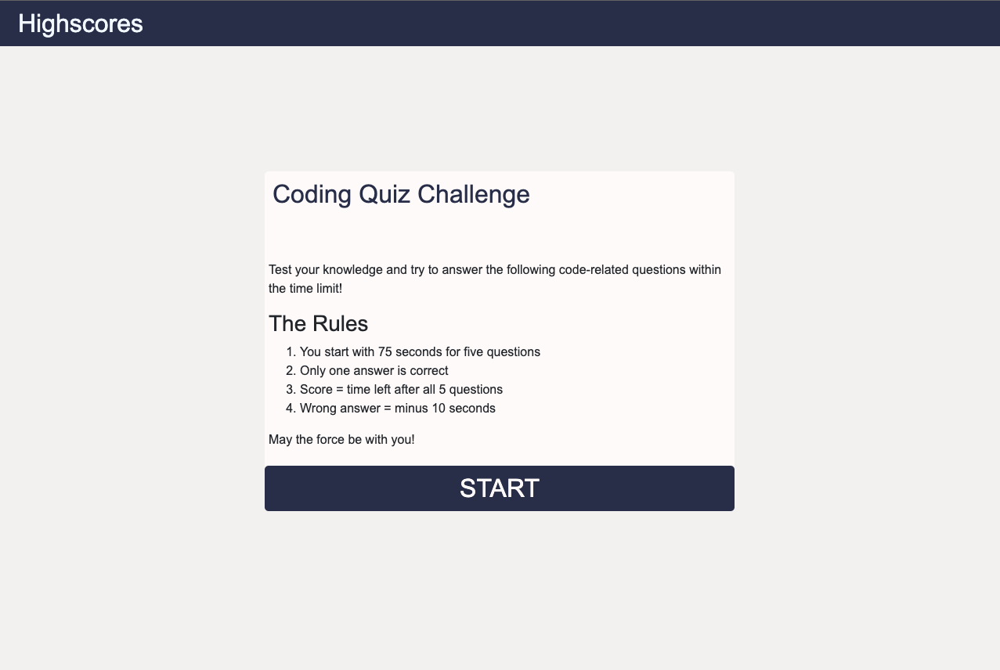

# Homework04CodeQuiz

This is the repository to hand in the homework from week 4

# Links to the files

- [GitHub Repository](https://github.com/laeuler/Homework04CodeQuiz)
- [GitHub Page](https://laeuler.github.io/Homework04CodeQuiz)

# Logic Flow and User Stories

The following graph shows the logic flow (order in which functions are executed)

# Mock-Up

The following image shows the web application's appearance and functionality:
Screenshotted with MacOS

### Startpage

The start page gives me the option to either see the existing highscores or start a new game

### Quiz Design

If you hover over an answer option, the option will be filled to indicate that you can click it

### Feedback During the Quiz

Green = positive, red = negative, timer color changes as well (at the beginning green, after 40s orange and under 20s red)

### Feedback after the quiz

- triggered when either time is up or all questions are answered
- Feedback whether the user made it on the list
- Option to save when this is the case and option to try again or check the highscores if not
  
  
  
  

### Highscore List

- After the prompt for my initials I am redirected to the new highscore page
- if I would score 70 in my next game, LE would be now #2, LE2 would become #3 and LE3 would drop out of the highscore list
- Clear List clears the local storage and thus the list
  

# Closing Remarks

Code could have been streamlined with jQuery Selector. Wasn't used in this case with regards to workload, lack of time to redo it.

Looking forward to the feedback

Lars
